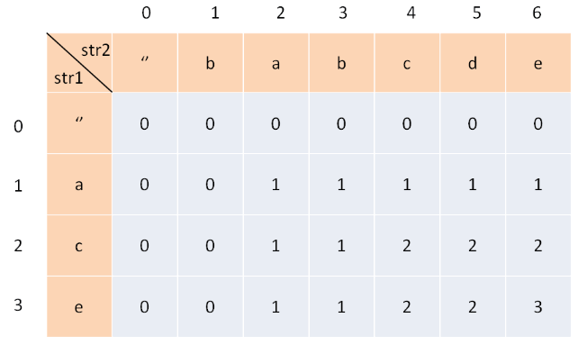

# 最长上升子序列
[最长上升子序列](https://leetcode-cn.com/problems/longest-increasing-subsequence/)

```
//@ 动态规划
class Solution {
public:
    int lengthOfLIS(vector<int>& nums) {        
        if (nums.empty()) return 0;
        int n = nums.size(), max_len = 0;
        vector<int> dp(n, 1);
        for (int i = 0; i<n; ++i)
        {
            for (int j = 0; j<i; ++j)
            {
                if (nums[j] < nums[i])
                    dp[i] = max(dp[i],dp[j] + 1);
            }
            max_len = max(max_len, dp[i]);
        }
        return max_len;
    }
};

//@ 贪心 + 二次查找
class Solution {
public:
    int lengthOfLIS(vector<int>& nums) {        
        if (nums.empty()) return 0;
        vector<int> vec{nums[0]};
		for(const auto num : nums)
		{
			if(num > vec.back())
				vec.push_back(num);
			else
			{
				auto it = lower_bound(vec.begin(),vec.end(),num);
				*it = num;
			}
		}
		return vec.size();
    }
};
```

# 最长公共子序列
[最长公共子序列](https://leetcode-cn.com/problems/longest-common-subsequence/)

对于两个字符串的动态规划问题，套路是通用的，必须要弄懂 dp 数组的含义：

其中，`dp[i][j]` 的含义是：对于 `s1[1..i]` 和 `s2[1..j]`，它们的 LCS 长度是 `dp[i][j]`。
比如上图的例子，d[2][4] 的含义就是：对于 `"ac"` 和 `"babc"`，它们的 LCS 长度是 2。我们最终想得到的答案应该是 `dp[3][6]`。
如果某个字符应该在 lcs 中，那么这个字符肯定同时存在于 s1 和 s2 中，因为 lcs 是最长公共子序列嘛。所以本题的思路是这样：用两个指针 i 和 j 从后往前遍历 s1 和 s2，如果 s1[i]==s2[j]，那么这个字符一定在 lcs 中；否则的话，s1[i] 和 s2[j] 这两个字符至少有一个不在 lcs 中，需要丢弃一个。

```
class Solution {
public:
    int longestCommonSubsequence(string text1, string text2) {
        if(text1.empty() || text2.empty()) return 0;
        int m = text1.size(),n = text2.size();
        vector<vector<int>> dp(m+1,vector<int>(n+1,0));
        for(int i=1;i<=m;++i)
        {
            for(int j =1;j<=n;++j)
            {
                if(text1[i-1] == text2[j-1])                
                    dp[i][j] = dp[i-1][j-1] + 1;
                else
                    dp[i][j] = max(dp[i-1][j],dp[i][j-1]);
            }
        }
        return dp.back().back();
    }
};
```

# 最大子序和

[最大子序和](https://leetcode-cn.com/problems/maximum-subarray/)

```
class Solution {
public:
    int maxSubArray(vector<int>& nums) {
        int prev = 0,maxSums = nums.empty() ? 0 : nums[0];
        for(auto num : nums)
        {
           //@ 比较当前的数和之前的数字累加当前的数字谁更大
            prev = max(num,prev+num);
            maxSums = max(maxSums,prev); //@ 记录全局最大累加和值
        }
        return maxSums;
    }
};
```

# 乘积最大子数组

[乘积最大子数组](https://leetcode-cn.com/problems/maximum-product-subarray/)

`dpMax[i]` 的话有几种取值：

- 当 `nums[i] >= 0` 并且 `dpMax[i-1] > 0`，`dpMax[i] = dpMax[i-1] * nums[i]`
- 当 `nums[i] >= 0` 并且 `dpMax[i-1] < 0`，此时如果和前边的数累乘的话，会变成负数，所以 `dpMax[i] = nums[i]`
- 当 `nums[i] < 0`，此时如果前边累乘结果是一个很大的负数，和当前负数累乘的话就会变成一个更大的数。所以我们还需要一个数组 `dpMin` 来记录以第 i 个元素的结尾的子数组，乘积最小的值。
  - 当 `dpMin[i-1] < 0`，`dpMax[i] = dpMin[i-1] * nums[i]`
  - 当 `dpMin[i-1] >= 0`，`dpMax[i] = nums[i]`

```
class Solution {
public:
    int maxProduct(vector<int>& nums) {
        if(nums.empty()) return 0;
		int n = nums.size();
        vector<int> dpMin(n),dpMax(n);
        dpMin[0] = nums[0];dpMax[0] = nums[0];
        for(int i=1;i<n;i++)
        {
            dpMax[i] = max(nums[i] * dpMin[i-1],max(nums[i],nums[i]*dpMax[i-1]));
            dpMin[i] = min(nums[i] * dpMin[i-1],min(nums[i],nums[i]*dpMax[i-1]));
        }
        return *max_element(dpMax.begin(),dpMax.end());
    }
};
```

空间优化：

```
class Solution {
public:
    int maxProduct(vector<int>& nums) {
        if(nums.empty()) return 0;
		int n = nums.size();
        int dpMin = nums[0],dpMax = nums[0],res = nums[0];
        for(int i=1;i<n;i++)
        {
			int preMax = dpMax;
            dpMax = max(nums[i] * dpMin,max(nums[i],nums[i]*dpMax));
            dpMin = min(nums[i] * dpMin,min(nums[i],nums[i]*preMax));
			
			res = max(dpMax,res);
        }
        return res;
    }
};
```