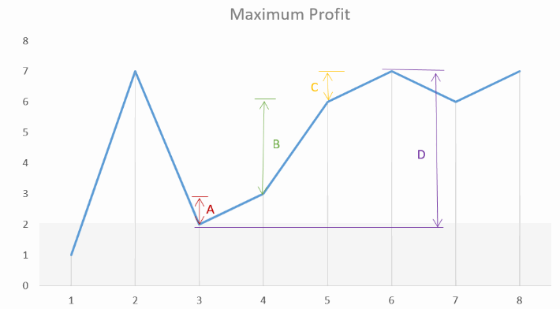

# 只买卖一次

[买卖股票的最佳时机](https://leetcode-cn.com/problems/best-time-to-buy-and-sell-stock/)

贪心：记录全局最小买入价格，以及全局最大收益。

```
class Solution {
public:
     int maxProfit(vector<int>& prices) {
        if (prices.size() < 2) return 0;
        int buy = INT_MAX, profit = 0;
        for (int i = 0; i<prices.size(); ++i)
        {
            buy = min(buy, prices[i]); //@ 记录可以买入的最低价格
            profit = max(profit, prices[i] - buy); //@ 记录最大利润，最小为0
        }
        return profit;
    }
};
```

动态规划：

每天只有两种状态：

- 买，`buy[i]`，表示第 i 天买入，买入是需要花钱的，因此是负数
- 卖，`sell[i]`，表示第 i 天卖出，卖出盈利

```
class Solution {
public:
    int maxProfit(vector<int>& prices) {
       if(prices.empty()) return 0;
       vector<int> buy(prices.size(),0);
       vector<int> sell(prices.size(),0);
       buy[0] = -prices[0]; 
	   for(int i=1;i<prices.size();++i)
	   {
	        //@ 最小代价买入
			buy[i] = max(buy[i-1],-prices[i]);
			//@ 最高价格售出
			sell[i] = max(sell[i-1],buy[i-1]+prices[i]);
	   }
       return sell.back();
    }
};
```

进一步分析可知，今天的买卖状态，只与前一天相关，可以压缩空间：

```
class Solution {
public:
    int maxProfit(vector<int>& prices) {
       if(prices.empty()) return 0;
       int buy = -prices[0],sell = 0;   
	   for(int i=1;i<prices.size();++i)
	   {
            int tmp = buy;
			buy = max(buy,-prices[i]);
			sell = max(sell,tmp + prices[i]);
	   }
       return sell;
    }
};
```

# 买卖无限次

[买卖股票的最佳时机 II](https://leetcode-cn.com/problems/best-time-to-buy-and-sell-stock-ii/)

贪心算法：找出所有的升区间，计算每个升区间的价格差，最终求和即为最大收益。

假设序列：`[1, 7, 2, 3, 6, 7, 6, 7]`

从上图中，我们可以观察到 `A+B+C` 的和等于差值 `D` 所对应的连续峰和谷的高度之差。

```
class Solution {
public:
    int maxProfit(vector<int>& prices) {
        if(prices.empty()) return 0;
		int maxProfit = 0;
        for(int i=1;i<prices.size();++i)
            if(prices[i] - prices[i-1] > 0)
                maxProfit += (prices[i] - prices[i-1]);
        return maxProfit;
    }
};
```

动态规划：

- `dp0[i]`：表示第 i 天不持有股票
- `dp1[i]`：表示第 i 天持有股票

```
class Solution {
public:
    int maxProfit(vector<int>& prices) {
        if(prices.empty()) return 0;
        int n = prices.size();
        vector<int> dp0(n,0);
	    vector<int> dp1(n,0);		
		dp1[0] = -prices[0]; //@ 初始状态
   
        for(int i=1;i<n;++i)
        {
            //@ 第i天不持有股票，可能是i-1天不持有，可能是i-1天持有，i天售出
        	dp0[i] = max(dp0[i-1],dp1[i-1]+prices[i]);
        	//@ 第i天持有股票，可能是i-1天持有，可能是i-1天不持有，i天买入
		    dp1[i] = max(dp1[i-1],dp0[i-1]-prices[i]);
        }
        return dp0[n-1];
    }
}; 
```

状态空间压缩：

```
class Solution {
public:
    int maxProfit(vector<int>& prices) {
        if(prices.empty()) return 0;
        int n = prices.size();
        int dp0 = 0,dp1 =  -prices[0]; //@ 初始状态
        
        for(int i=1;i<n;++i)
        {
			int prev_dp0 = dp0;
            dp0 = max(dp0,dp1+prices[i]);
            dp1 = max(dp1,prev_dp0 - prices[i]);
        }
        return dp0;
    }
};
```

# 买卖两次

[买卖股票的最佳时机 III](https://leetcode-cn.com/problems/best-time-to-buy-and-sell-stock-iii/)

动态规划：

- `dp0[i][j]`：第 i 天发生 j 次交易，手里不持有股票的最大收益
- `dp1[i][j]`：第 i 天发生 j 次交易，手里持有股票的最大收益

注意，这里只的交易次数是指 `买->卖` 这个过程都发生了：

```
class Solution {
public:
  int maxProfit(vector<int>& prices) {    
		if(prices.empty()) return 0;
		int n = prices.size();
	
		vector<vector<int>>dp0(n, vector<int>(3,  0)); //@ 不持有股票
		vector<vector<int>>dp1(n, vector<int>(3,  0)); //@ 持有股票
		for(int j = 0; j <= 2; j++) 
			dp1[0][j] = -prices[0]; 
		for(int i = 1; i < n; i++){	
			//@ 持有股票,但是没有发生交易，应该挑选最低的买入价格
			dp1[i][0] = max(dp1[i-1][0], -prices[i]); 
			for(int j=1;j<3;++j)
			{
				//@ 第i天发生了j次交易，不持有股票：i-1天发生了j笔交易或者i-1天发生了j-1笔交易，并且手里有股票在i天卖出
				dp0[i][j] = max(dp0[i-1][j], dp1[i-1][j-1] + prices[i]); 
				//@ 第i天发生了j次交易，持有股票：i-1天发生了j笔交易，那么再考虑今天是否买入即可
				dp1[i][j] = max(dp1[i-1][j], dp0[i-1][j] - prices[i]);
			}
		}
		return dp0[n-1][2]; //@ 最后一天，交易两次
	}
};
```

# 买卖k次

[买卖股票的最佳时机 IV](https://leetcode-cn.com/problems/best-time-to-buy-and-sell-stock-iv/)

动态规划：

- 如果 k 次数超过天数的一半，其实就是不限制次数买卖
- 如果 k 次数较小，与上面买卖两次的题目类似，将 2 变成 k即可

```
class Solution {
public:
int maxProfit(int k, vector<int>& prices) {
    if(k <=0 || prices.empty()) return 0;
    int n = prices.size();    
    if (k > n/2) 
    { 
        int maxProfit = 0; 
        for (int i = 1; i < n; i++)
            maxProfit += max(0, prices[i] - prices[i - 1]);
        return maxProfit;
    }
    
    vector<vector<int>>dp0(n, vector<int>(k+1,  0));
    vector<vector<int>>dp1(n, vector<int>(k+1,  0));
    
    for(int j = 0; j <= k; j++) 
        dp1[0][j] = -prices[0]; 
    for(int i = 1; i < n; i++){
        dp1[i][0] = max(dp1[i-1][0], -prices[i]);         
        for(int j = 1; j <= k; j++)
        {
            dp0[i][j] = max(dp0[i-1][j], dp1[i-1][j-1] + prices[i]); // 保持 or 卖出
            dp1[i][j] = max(dp1[i-1][j], dp0[i-1][j] - prices[i]); // 保持 or 买入
        }
    }
    return dp0[n-1][k];
}
};
```

# 有冷冻期

[最佳买卖股票时机含冷冻期](https://leetcode-cn.com/problems/best-time-to-buy-and-sell-stock-with-cooldown/)

```
class Solution {
public:
    int maxProfit(vector<int>& prices) {
		if(prices.empty()) return 0;
		int n = prices.size();
		vector<int> dp0(n,0);
		vector<int> dp1(n,0);
		vector<int> cool(n,0);
		
		dp1[0] = -prices[0];
		for(int i=1;i<n;++i)
		{
			dp0[i] = max(dp0[i-1],dp1[i-1]+prices[i]);
			//@ 卖出之前，必须是冷冻期
			dp1[i] = max(dp1[i-1],cool[i-1]-prices[i]); 
			 //@ i 天是冷冻期：i-1天就是冷冻期，或者i-1天买入了股票
			cool[i] = max(cool[i-1],dp0[i-1]);
		}		
		return dp0[n-1];
    }
};
```

空间优化：

```
class Solution {
public:
    int maxProfit(vector<int>& prices) {
		if(prices.empty()) return 0;
		int n = prices.size();

		int dp0 = 0,dp1 = -prices[0],cool = 0;	
		for(int i=1;i<n;++i)
		{
			int tmp = dp0;
			dp0 = max(dp0,dp1+prices[i]);
			dp1 = max(dp1,cool-prices[i]); 
			cool = max(cool,tmp);
		}		
		return dp0;
    }
};
```

# 有手续费

[买卖股票的最佳时机含手续费](https://leetcode-cn.com/problems/best-time-to-buy-and-sell-stock-with-transaction-fee/)

动态规划：与之前的题目类似，这里直接给出状态空间优化后的版本：

```
class Solution {
public:
    int maxProfit(vector<int>& prices, int fee) {
        if(prices.empty()) return 0;
        int n = prices.size();
        int dp0 = 0,dp1 = -prices[0];
        for(int i=1;i<n;++i)
        {
            int prev_dp0 = dp0;
            dp0 = max(dp0,dp1+prices[i]-fee);
            dp1 = max(dp1,prev_dp0-prices[i]);
        }
        return dp0;
    }
};
```