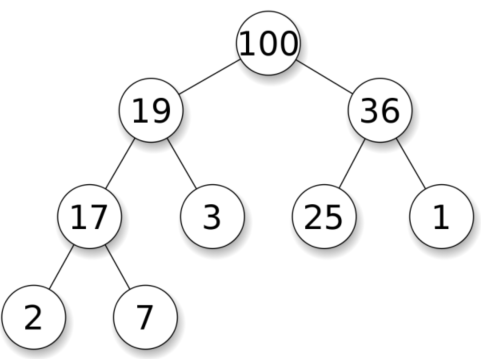

# 堆

优先队列（priority queue）可以在 `O(1)` 时间内获得最大值，并且可以在 `O(logN)` 时间内取出
最大值或插入任意值。

优先队列常常用堆（heap）来实现。堆是一个完全二叉树，其每个节点的值总是大于等于子节点的值。实际实现堆时，我们通常用一个数组而不是用指针建立一个树。这是因为堆是完全二叉树，所以用数组表示时，位置 `i` 的节点的父节点位置一定为 i/2，而它的两个子节点的位置又一定分别为 `2i `和 `2i+1`。

以下是堆的实现方法，其中最核心的两个操作是上浮和下沉：如果一个节点比父节点大，那么需要交换这个两个节点；交换后还可能比它新的父节点大，因此需要不断地进行比较和交换操作，我们称之为上浮；类似地，如果一个节点比父节小，也需要不断地向下进行比较和交换操作，我们称之为下沉。如果一个节点有两个子节点，我们总是交换最大的子节点。 



```
vector<int> heap;
// 获得最大值
void top() {
	return heap[0];
}
// 插入任意值： 把新的数字放在最后一位， 然后上浮
void push(int k) {
	heap.push_back(k);
	swim(heap.size() - 1);
}
// 删除最大值： 把最后一个数字挪到开头， 然后下沉
void pop() {
	heap[0] = heap.back();
	heap.pop_back();
	sink(0);
}
// 上浮
void swim(int pos) {
	while (pos > 1 && heap[pos/2] < heap[pos])) {
	swap(heap[pos/2], heap[pos]);
	pos /= 2;
	}
}
// 下沉
void sink(int pos) {
	while (2 * pos <= N) {
	int i = 2 * pos;
	if (i < N && heap[i] < heap[i+1]) ++i;
	if (heap[pos] >= heap[i]) break;
	swap(heap[pos], heap[i]);
	pos = i;
	}
}
```


# [378. 有序矩阵中第K小的元素](https://leetcode-cn.com/problems/kth-smallest-element-in-a-sorted-matrix/)

```
class Solution {
public:
    int kthSmallest(vector<vector<int>>& matrix, int k) {
        priority_queue<int> pq;
        for(const auto row : matrix)
        {
            for(const auto num : row)
            {
                pq.push(num);
                if(pq.size() > k)
                    pq.pop();
            }
        }
        return pq.top();
    }
};
```

# [23. 合并K个升序链表](https://leetcode-cn.com/problems/merge-k-sorted-lists/)

```
class Solution {
public:
    struct cmp{
        bool operator()(ListNode* a,ListNode* b)
        {
            return a->val > b->val;
        }        
    };

    ListNode* mergeKLists(vector<ListNode*>& lists) {
        priority_queue<ListNode*,vector<ListNode*>,cmp> pq;
        for(auto list : lists)
            if(list)
                pq.push(list);
        
        ListNode node(-1);
        ListNode* dummy = &node,*curr = dummy;
        while(!pq.empty())
        {
            ListNode* tmp = pq.top();
            pq.pop();
            curr->next = tmp;
            curr = curr->next;
            if(tmp->next)
                pq.push(tmp->next);
        }
        return dummy->next;
    }
};
```

# [295. 数据流的中位数](https://leetcode-cn.com/problems/find-median-from-data-stream/)

```
class MedianFinder {
public:
    //@ 存放较小的一半元素，堆顶元素为该堆的最大值
    priority_queue<int,vector<int>,less<int>>    small;   
    //@ 存放较大的一半元素，堆顶元素为该堆的最小值
    priority_queue<int,vector<int>,greater<int>> large; 

    MedianFinder() {
    }
    
    void addNum(int num) {
        small.push(num);
        large.push(small.top());
        small.pop();

        //@ small的元素个数大于或等于large的元素个数
        if(large.size() > small.size()) 
        {
            small.push(large.top());
            large.pop();
        }
    }
    
    double findMedian() {
        return small.size() > large.size() ? (double) small.top() : (small.top() + large.top()) * 0.5;
    }
};
```

# [703. 数据流中的第 K 大元素](https://leetcode-cn.com/problems/kth-largest-element-in-a-stream/)

```
class KthLargest {
    int K_;
    priority_queue<int,vector<int>,greater<int>> pq_;
public:
    KthLargest(int k, vector<int>& nums) {
        for (int n : nums) {
            pq_.push(n);
            if (pq_.size() > k) 
                pq_.pop();
        }       
        K_ = k;
    }
    
    int add(int val) {
        pq_.push(val);
        if (pq_.size() > K_) 
            pq_.pop();
        return pq_.top();

    }
};
```

