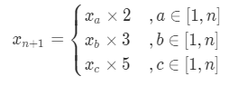

# 丑数

[丑数](https://leetcode-cn.com/problems/ugly-number/)

```
class Solution {
public:
    bool isUgly(int num) {
        while(num)
        {
            if(num % 2 == 0) 
                num /= 2;
            else if(num % 3 == 0) 
                num /= 3;
            else if(num % 5 == 0) 
                num /= 5;
            else
                break; 
        }
        return num == 1;
    }
};
```

# 丑数

[丑数](https://leetcode-cn.com/problems/chou-shu-lcof/)

动态规划：



```
class Solution {
public:
    int nthUglyNumber(int n) {
		vector<int> dp(n,1);
		int a = 0,b = 0,c = 0;
		for(int i = 1;i < n;++i)
		{
			int n2 = dp[a] * 2,n3 = dp[b] * 3,n5 = dp[c] * 5;
			dp[i] = min(n2,min(n3,n5));
            //@ 去除重复的元素
			if(dp[i] == n2) a++;
			if(dp[i] == n3) b++;
			if(dp[i] == n5) c++;			
		}
        return dp.back();
    }
};
```

# 超级丑数

[超级丑数](https://leetcode-cn.com/problems/super-ugly-number/)

```
class Solution
{
public:
    int nthSuperUglyNumber(int n, vector<int> &primes)
    {
        int k = primes.size();
        vector<int> res(n);
        vector<int> kv(k, 0); //用来记录这k个数的指针位置，初始化为0
        res[0] = 1;
        for (int i = 1; i < n; i++)
        {
            int mini = INT_MAX;
            for (int j = 0; j < k; j++)
                mini = min(mini, res[kv[j]] * primes[j]);
            for (int j = 0; j < k; j++)
            {
                if (mini == res[kv[j]] * primes[j])
                    kv[j]++;
            }
            res[i] = mini; //记录最小值
        }
        return res.back();
    }
};
```

# 丑数 III

[丑数 III](https://leetcode-cn.com/problems/ugly-number-iii/)

求任意一个数 `x`，在 `[1,x]` 区间内有几个丑数？只要 `(x/a)+(x/b)+(x/c)` 即可，但是可能会有重复的值，比如 `a=2，b=3` 时，丑数6就会多计算一次，所以还需要减去  `(x/lcm(a,b) + x/lcm(c,b)  + x/lcm(a,c))`。这里 `lcm(a,b)` 表示 `a` 和 `b` 的最小公倍数。还有 `lcm(a,b,c)` 的情况，因为前面求两两最小公倍数的时候多减了一次，所以这里要再加上 `x/lcm(a,b,c)` ，这里就可以得到 `x` 前面有几个丑数，即为 `count`。由于 `x` 不一定是丑数，只要求出小于 `x` 的最大丑数，这个丑数所在的位置就是 `count` 。由于丑数的数量随着 `x` 的增加而增加，所以用二分查找的方法很容易就可以求得指定位置的丑数。

```
typedef long long LL;
 
class Solution {
public:
	//@ 求两个数的最大公约数
    LL gcd(LL a, LL b) {
        return b == 0 ? a : gcd(b, a % b);
    }
 
    int nthUglyNumber(int n, int a, int b, int c) {
        LL gcd_ab = gcd(a, b), gcd_bc = gcd(b, c), gcd_ac = gcd(a, c);
        LL lcm_ab = static_cast<LL>(1.0 * a * b / gcd_ab), lcm_ac = static_cast<LL>(1.0 * a * c / gcd_ac), 
        lcm_bc = static_cast<LL>(1.0 * b * c / gcd_bc);
        LL lcm_abc = lcm_ab * c / gcd(lcm_ab, c);
        LL left = 1, right = static_cast<LL>(2e9 + 1);
        while (left <= right) {
            LL mid = (left + right) / 2;
            LL cnt = mid / a + mid / b + mid / c - mid / lcm_ab - mid / lcm_ac - mid / lcm_bc + mid / lcm_abc;
            if (cnt < n) {
                left = mid + 1;
            } else {
                right = mid - 1;
            }
        }
        return static_cast<int>(left);
    }
};
```


