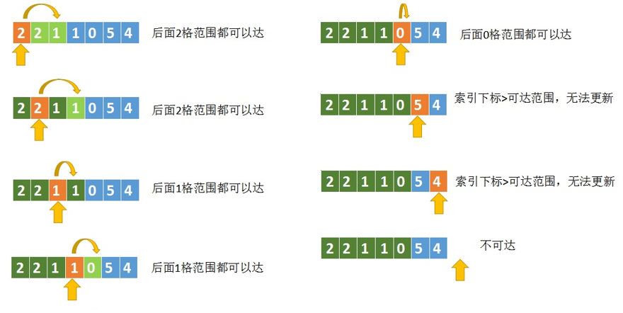
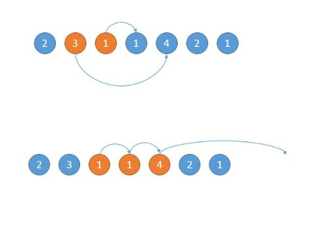

# 跳跃游戏

[跳跃游戏](https://leetcode-cn.com/problems/jump-game/)



每次更新的时候，看看最大可达范围是否 大于等于当前遍历到的数组下标，如果是才更新。否则说明这个区域是不可达的，当然也就不用更新了。

```
class Solution {
public:
   bool canJump(vector<int>& nums) 
   {
       int longest = 0;
       for(int i=0;i<nums.size();i++)
       {
           if(i > longest)
                return false;
            longest = max(longest,i+nums[i]);
       }
       return true;
   }
};
```

# 跳跃游戏 II

[跳跃游戏 II](https://leetcode-cn.com/problems/jump-game-ii/)

每次在可跳范围内选择可以使得跳的更远的位置。如下图，开始的位置是 2，可跳的范围是橙色的。然后因为 3 可以跳的更远，所以跳到 3 的位置。然后现在的位置就是 3 了，能跳的范围是橙色的，然后因为 4 可以跳的更远，所以下次跳到 4 的位置。



```
class Solution {
public:
    int jump(vector<int>& nums) {
        int longest = 0,steps = 0,ending = 0;
        for(int i=0;i<nums.size()-1;++i)
        {
            longest = max(longest,i+nums[i]);
            if(i == ending)
            {
                ending = longest;
                steps++;
            }
        }
        return steps;
    }
};
```

