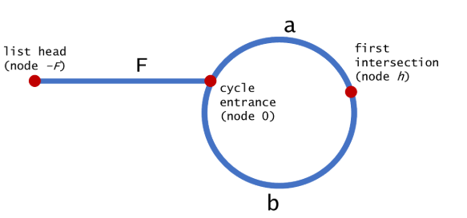

# 快慢指针

快慢指针：需要两个指针，开始都指向开头，根据条件不同，快指针走得快，慢指针走的慢，直到满足条件或者快指针走到结尾

简记：快慢指针走到头

# 环形链表 II

[环形链表 II](https://leetcode-cn.com/problems/linked-list-cycle-ii/)

快慢指针，首先判断链表是否有环，如果有环再找入口点。

判断是否有环：

当一个跑得快的人和一个跑得慢的人在一个圆形的赛道上赛跑，会发生什么？在某一个时刻，跑得快的人一定会从后面赶上跑得慢的人。

查找入口点：


$$
\begin{aligned}
2 \cdot \text { distance}(\text {tortoise}) &=\text {distance}(\text {hare}) \\
2(F+a) &=F+a+b+a \\
2 F+2 a &=F+2 a+b \\
F &=b
\end{aligned}
$$

```
class Solution {
public:
    ListNode *detectCycle(ListNode *head) {
         ListNode *fast= head,*slow = head;
		 do{
			if(fast == nullptr || fast->next == nullptr)
				return nullptr;			
			fast = fast->next->next;
			slow = slow->next;		 
		 }while(fast != slow);
		 
		 fast = head;
		 while(fast != slow)
		 {
			slow = slow->next;
			fast = fast->next;
		 }
		
		return fast;
    }
};
```

哈希解法：

```
class Solution {
public:
    ListNode *detectCycle(ListNode *head) {
		unordered_set<ListNode *> nodeSet;
		ListNode *node = head;
		while(node != nullptr)
		{
			if(nodeSet.find(node) != nodeSet.end())
				return node;
			nodeSet.insert(node);
			node = node->next;
		}
		
		return nullptr;
    }
};
```

# 移除元素

[移除元素](https://leetcode-cn.com/problems/remove-element/)

使用slow和fast两个指针，从头部开始遍历，遍历一次fast指针前进一步，当遍历元素不满足指定的值，slow指针前进一步，这样不满足条件的整数都被移动到数组的前面。

```
class Solution {
public:
    int removeElement(vector<int>& nums, int val) {
        int slow = 0,fast = 0,n = nums.size();
        while(fast < n)    
        {
            if(nums[fast] != val) 
                nums[slow++] = nums[fast];
            fast++;
        }                
        return slow;
    }
};
```

# 移动零

[移动零](https://leetcode-cn.com/problems/move-zeroes/)

使用slow和fast两个指针，从头部开始遍历，遍历一次fast指针前进一步，当遍历元素不等于0，slow指针前进一步，这样不等于0的整数都被移动到数组的前面。

```
class Solution {
public:
    void moveZeroes(vector<int>& nums) {
        int slow = 0,fast = 0,n = nums.size();
        while(fast < n)
        {
            if(nums[fast] != 0)
                swap(nums[slow++],nums[fast]);
            fast++;
        }        
    }
};
```

# 删除排序数组中的重复项

[删除排序数组中的重复项](https://leetcode-cn.com/problems/remove-duplicates-from-sorted-array/)

使用快慢指针来记录遍历的坐标，最开始时两个指针都指向第2个数字，如果快指针指向的数等于慢指针的前1个数，则快指针向前走一步，如果不同，则两个指针都向前走一步，这样当快指针走完整个数组后，慢指针当前的坐标就是数组中不同数字的个数。

```
class Solution {
public:
    int removeDuplicates(vector<int>& nums) {
        int slow = 1, fast = 1, n = nums.size();
        if(n <= 1) return n;
        while(fast < n){
            if(nums[fast] != nums[slow - 1]) nums[slow++] = nums[fast];
            fast++;
        }
        return slow;
    }
};
```

# 删除排序数组中的重复项 II

[删除排序数组中的重复项 II](https://leetcode-cn.com/problems/remove-duplicates-from-sorted-array-ii/)

使用快慢指针来记录遍历的坐标，最开始时两个指针都指向第3个数字，如果快指针指向的数等于慢指针的前2个数，则快指针向前走一步，如果不同，则两个指针都向前走一步，这样当快指针走完整个数组后，慢指针当前的坐标就是数组中不同数字的个数。

```
class Solution {
public:
    int removeDuplicates(vector<int>& nums) {
        int slow = 2, fast = 2, n = nums.size();
        if(n <= 2) return n;
        while(fast < n){
            if(nums[fast] != nums[slow - 2]) 
                nums[slow++] = nums[fast];
            fast++;
        }
        return slow;
    }
};
```


