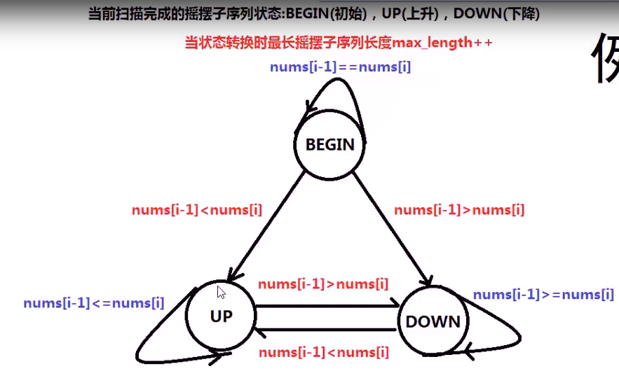

# 摆动序列

[摆动序列](https://leetcode-cn.com/problems/wiggle-subsequence/)

这里使用了状态机的方法：



```
class Solution {
public:
    int wiggleMaxLength(vector<int>& nums) {
        int n = nums.size();
        if(n < 2) return n;

        enum STATE {BEGIN = 0,UP,DOWN};
        STATE state = BEGIN;
        int max_len = 1;
        for(int i=1;i<n;i++)
        {
            switch(state)
            {
                case BEGIN:
                    if(nums[i-1] < nums[i])
                    {
                        state = UP;
                        max_len++;
                    }
                    else if(nums[i-1] > nums[i])
                    {
                        state = DOWN;
                        max_len++;
                    }
                    break;
                case UP:
                    if(nums[i-1] > nums[i])
                    {
                        state = DOWN;
                        max_len++;
                    }
                    break;
                case DOWN:
                if(nums[i-1] < nums[i])
                {
                    state = UP;
                    max_len++;
                }
                break;
            }
        } 
        return max_len;
    }
};
```


55

45


