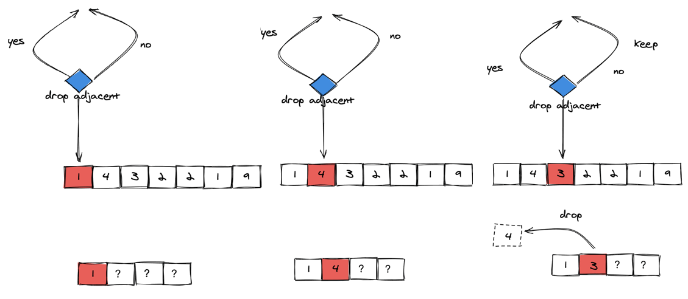

# 判断子序列

[判断子序列](https://leetcode-cn.com/problems/is-subsequence/)

```
class Solution {
public:
    bool isSubsequence(string s, string t) {
        int k = 0;
        for(int i=0;i<t.size() && k<s.size();i++)
        {
            if(t[i] == s[k])
                k++;
        }
        return k == s.size();
    }
};
```

# 移掉K位数字

[移掉K位数字](https://leetcode-cn.com/problems/remove-k-digits/)

这里借助利用栈的贪心算法完成：

对于两个相同长度的数字序列，最左边不同的数字决定了这两个数字的大小，例如，对于 A = 1axxx，B = 1bxxx，如果 a > b 则 A > B。

知道了这个以后，我们可以想到，在删除数字时应该从左向右迭代。确定了迭代的顺序以后，就必须制定如何消除数字的标准，以便获得最小值。



```
class Solution {
public:
    string removeKdigits(string num, int k) {
        std:vector<int> S;
        std::string res;
        for(int i=0;i<num.size();++i)
        {
            int x = num[i] - '0';
            while(!S.empty() && S.back() > x && k)
            {
                S.pop_back();
                k--;
            }
            if(x != 0 || !S.empty())
            	S.push_back(x);  
        }
		
        //@ 数值非0或者当前插入位置不是起始位置
		while(!S.empty() && k > 0)
		{
			S.pop_back();
			k--;
		}
		for(int i=0;i<S.size();i++)
			res.append(1,'0' + S[i]);      

        //@ 移除全部数字的情况
        if(res == "")
            return "0";
        return res;
    }
};
```

# 去除重复字母

[去除重复字母](https://leetcode-cn.com/problems/remove-duplicate-letters/)

```
class Solution {
public:
    string removeDuplicateLetters(string s) {
		unordered_map<char,int> remain_counter;
		for(const auto str : s)
			remain_counter[str]++;
		
		vector<char> S;
		for(const auto c : s)
		{
			if(find(S.begin(),S.end(),c) == S.end())
			{
				//@ 栈不为空，并且当前的字符小于栈尾元素，并且末尾这个字符后面还有机会出现
				while(!S.empty() && c < S.back() && remain_counter[S.back()] > 0)				
					S.pop_back();	
				S.push_back(c);
			}			
			remain_counter[c]--;
		}		
		return string(S.begin(),S.end());
    }
};
```

# 不同字符的最小子序列

[不同字符的最小子序列](https://leetcode-cn.com/problems/smallest-subsequence-of-distinct-characters/)

```
class Solution {
public:
    string smallestSubsequence(string s) {
        vector<int> times(26, 0);
        vector<bool> visited(26, false);

        stack<char> S;
        for (const auto c : s)
            times[c - 'a']++;
        for (const auto c : s)
        {
            times[c - 'a']--;
            if (visited[c - 'a'])
                continue;		
                
            while(!S.empty() && S.top() > c && times[S.top()-'a'] > 0)
            {
                visited[S.top()-'a'] = false;
                S.pop();
            }                
            S.push(c);   
            visited[c-'a'] = true;         
        }

        string res = "";
        while(!S.empty())
        { 
            res = S.top() + res;
            S.pop();
        }
        return res;
    }
};
```


