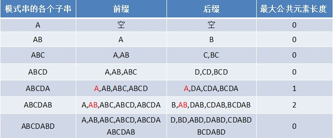
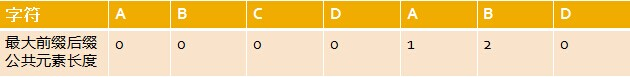
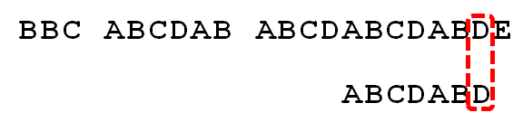
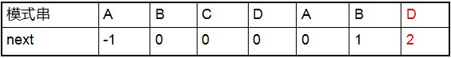
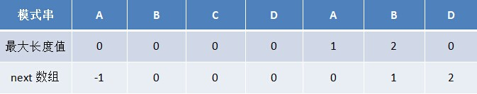
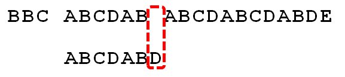
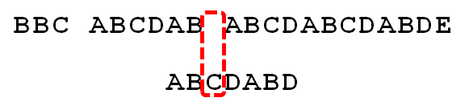

# KMP算法

## 暴力匹配

有一个字符串 `"BBC ABCDAB ABCDABCDABDE"`，我想知道，里面是否包含另一个字符串 `"ABCDABD"` 。

首先，字符串 `"BBC ABCDAB ABCDABCDABDE"` 的第一个字符与搜索词 `"ABCDABD"` 的第一个字符，进行比较。因为 `B` 与 `A` 不匹配，所以搜索词后移一位。


因为 `B` 与 `A` 不匹配，搜索词再往后移。


就这样，直到字符串有一个字符，与搜索词的第一个字符相同为止。


接着比较字符串和搜索词的下一个字符，还是相同。


直到字符串有一个字符，与搜索词对应的字符不相同为止。这时，最自然的反应是，将搜索词整个后移一位，再从头逐个比较。这样做虽然可行，但是效率很差，因为你要把"搜索位置"移到已经比较过的位置，重比一遍。


## KMP

### 最大长度表

如果给定的模式串是：`ABCDABD`，从左至右遍历整个模式串，其各个子串的前缀后缀分别如下表格所示：



原模式串子串对应的各个前缀后缀的公共元素的最大长度表为：



### 基于最大长度表匹配

因为模式串中首尾可能会有重复的字符，故可得出下述结论，失配时：

```
模式串向右移动的位数 = 已匹配字符数 - 失配字符的上一位字符所对应的最大长度值
```

已知空格与 `D` 不匹配时，前面六个字符 `"ABCDAB"` 是匹配的。查表可知，最后一个匹配字符 `B` 对应的"部分匹配值"为2，因此按照公式 `6 - 2`  等于 `4`，所以将搜索词向后移动 `4` 位：


因为空格与 `C` 不匹配，搜索词还要继续往后移。移动位数 = `2 - 0`，结果为 `2`，于是将搜索词向后移 `2` 位：


逐位比较，直到发现 `C` 与 `D` 不匹配。于是，移动位数 = `6 - 2`，继续将搜索词向后移动 `4` 位：



逐位比较，直到搜索词的最后一位，发现完全匹配，于是搜索完成。如果还要继续搜索（即找出全部匹配），移动位数 = `7 - 0`，再将搜索词向后移动 `7` 位，这里就不再重复了。

### next 数组

当匹配到一个字符失配时，其实没必要考虑当前失配的字符，更何况我们每次失配时，都是看的失配字符的上一位字符对应的最大长度值。如此，便引出了 `next` 数组。

给定字符串 `"ABCDABD"`，可求得它的 `next` 数组如下：



把 `next` 数组跟之前求得的最大长度表对比后，不难发现，`next` 数组相当于 “最大长度值” 整体向右移动一位，然后初始值赋为 `-1`。

对于给定的模式串：`"ABCDABD"`，它的最大长度表及 `next` 数组分别如下：



根据最大长度表求出了 `next`  数组后，从而有，失配时：

```
模式串向右移动的位数 = 失配字符所在位置 - 失配字符对应的 next 值
```

无论是基于最大长度表的匹配，还是基于 `next` 数组的匹配，两者得出来的向右移动的位数是一样的：

- 根据最大长度表，失配时，`模式串向右移动的位数 = 已经匹配的字符数 - 失配字符的上一位字符的最大长度值`
- 而根据 `next` 数组，失配时，`模式串向右移动的位数 = 失配字符的位置 - 失配字符对应的 next 值`

其中，从0开始计数时，`失配字符的位置 = 已经匹配的字符数（失配字符不计数）`，而 `失配字符对应的next 值 = 失配字符的上一位字符的最大长度值`，两相比较，结果必然完全一致。

### 通过代码递推计算 next  数组

如果对于值 `k`，已有`p0 p1, ..., pk-1 = pj-k pj-k+1, ..., pj-1`，相当于 `next[j] = k`。究其本质，`next[j] = k` 代表 `p[j]`  之前的模式串子串中，有长度为 `k`  的相同前缀和后缀。有了这个 `next` 数组，在 KMP 匹配中，当模式串中 `j` 处的字符失配时，下一步用 `next[j]` 处的字符继续跟文本串匹配，相当于模式串向右移动`j - next[j]` 位。

如下图，根据模式串 `"ABCDABD"` 的 `next` 数组可知失配位置的字符 `D` 对应的 `next` 值为2，代表字符 `D` 前有长度为 `2` 的相同前缀和后缀（这个相同的前缀后缀即为 `"AB"` ），失配后，模式串需要向右移动`j - next [j] = 6 - 2 =4`位。



向右移动 `4` 位后，模式串中的字符 `C` 继续跟文本串匹配：



下面的问题是：已知 `next [0, …, j]`，如何求出 `next [j + 1]` 呢？


